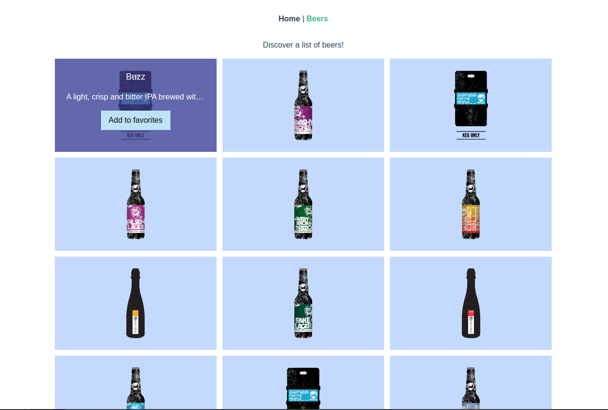

# kiss my Test - Vue.js
Bienvenue sur le repo de test frontend de kiss my :-)

## Pré-requis
Pour effectuer ce test, il vous faudra installer les technologies suivantes :  

- [Git](https://git-scm.com/download/win)
- [Nodejs](https://nodejs.org/en/download/)
- [Yarn](https://classic.yarnpkg.com/en/docs/install/)
- [Vue CLI](https://cli.vuejs.org/guide/installation.html)


### Note importante
Si vous êtes dans l'un des cas suivants :   
* Utilisateur de Windows  
* Vous n'arrivez pas à installer une dépendance  
* Vous n'arrivez pas à utiliser le terminal  

Merci de ne pas nous solliciter pour vous aider sur ces sujets (si vous avez d'autres types de difficultés n'hésitez pas à nous contacter). Vous **devez** être en mesure d'y arriver - pour les utilisateurs Windows
 par exemple, en utilisant WSL, ou une VM - et **l'installation de l'environnement de travail fait effectivement partie du test !**  

## Technologies utilisées
Dans ce test, vous allez toucher aux technologies suivantes:
- Vue.js, un framework JavaScript utilisé (notamment) pour communiquer avec une API et faire de belles interfaces réactives ([Documentation](https://vuejs.org/v2/guide/))  


## Installation
Pour commencer le test, clonez ce dépôt dans un dossier, et ouvrez un terminal dans le dossier du projet.  
Lancez-y la commande suivante afin d'installer les dépendances npm du projet :  

```
yarn install
```

Ensuite, lancez le projet avec la commande suivante :  

```
yarn serve
```

Enfin, rendez-vous sur [http://localhost:8081/](http://localhost:8081/) .

## Objectif du test
Ce test est un parcours dédié pour les devs Frontend.  
L'objectif est de réaliser une simple application qui consomme une API REST que vous pourrez choisir [parmi les API publiques disponibles sur ce repo](https://github.com/public-apis/public-apis) ou toute autre API publique du même style.  

Cette application, sous la forme d'une SPA, doit comporter les vues suivantes :  
* Une vue de listing (obligatoire)  
* Une vue de détails (obligatoire)  
* Une vue de gestion des favoris (obligatoire)  
* Une landing page / page d'accueil (optionnel)  
* Ainsi que du gabarit global (Header/Content/Footer)  

Par exemple, si je choisis d'utiliser [l'API TMDB](https://www.themoviedb.org/documentation/api), mes vues seront :  
* Une vue de listing des films (avec la possibilité d'ajouter un film en favori) 
* Une vue avec le détail d'un film (avec la possibilité d'ajouter ce film en favori) 
* Une vue de gestion des favoris, qui liste les films favoris, permet de voir leur détail au clic, et de supprimer un favori  
* La landing page reste totalement libre et optionnelle, à vous de voir si vous avez une idée ;)  

**Essayez de choisir une API un minimum riche : l'API des Cat Facts c'est mignon, mais le contenu sera vite limité, surtout sur la page détails ! Favorisez des API avec des images, une pagination, ou même avec du son ou une galerie de médias si vous êtes vraiment motivés ;)**   

**Exemple de la page listing :**




### Détail des fonctionnalités attendues pour chaque vue (= page)

#### Gabarit de l'application
L'application doit disposer :  
* d'une navigation principale : Accueil (le cas échéant), Liste, Favoris  
* d'une zone de contenu principale  
* d'un footer avec un copyright  

On aime quand le footer, s'il a un fond différent, soit bien ferré au bas de la page, même si le contenu n'est pas assez haut ;)  

#### Page de listing
Sur la page de listing, vous devrez afficher un nombre arbitraire d'éléments, et proposer une pagination afin de charger de nouveaux éléments.  

* Si l'API choisie ne propose pas de pagination, vous pouvez la remplacer par un bouton "Charger de nouveaux éléments" (films, citations, musics...)  
* Si l'API propose une pagination, le choix du type de pagination est libre : pagination classique avec numéros de pages, infinite scroll, bouton "Load more"...  

Sur chaque élément, un bouton d'ajout aux favoris sera disponible, différencié si l'élément est déjà en favoris (Ajouter/Retirer). Au clic, l'élément sera ajouté aux / retiré des favoris, 
et un message informera l'utilisateur de la réussite de l'action.  

Enfin, au clic sur chaque élément, l'utilisateur sera dirigé vers la page de détails.  

#### Page de détails
La page de détails contient :
* tous les détails disponibles sur un élément  
* un bouton d'ajout aux favoris, différencié si l'élément est déjà en favoris (Ajouter/Retirer)  
* un bouton/lien de retour au listing positionné de manière ergonomique  
* éventuellement, une navigation prev/next pour changer d'élément  

#### Page de listing/gestion des favoris
Elle contient :  
* le listing des favoris - vous pouvez baser vos composants sur le listing des éléments, mais la pagination est ici optionnelle  
* un bouton Retirer des favoris (même comportement que sur le listing, lorsqu'un élément est déjà en favoris)  
* au clic sur un élément, on arrive sur la page de détails  

**Point d'attention : vous devrez stocker les favoris dans le Store [VueX](https://vuex.vuejs.org/) de sorte que lorsque vous serez sur la page de listing ou de détails, vous puissiez savoir si un élément est dans les favoris ou pas !**  

**Optionnel mais très apprécié : stocker les favoris dans un cookie ou dans le localStorage afin qu'ils soient persistés quand on recharge l'application, et ré-hydrater le Store VueX des favoris au nouveau chargement !**  
(vous pouvez faire ça avec les ID ou stocker les éléments complets, à vous de voir)

#### Landing page (optionnel)
Là, c'est open bar. À vous de voir ce que vous trouvez de pertinent à mettre ;)  

## Journal de bord
Nous vous prions, lors de la réalisation de ce test, d'écrire votre "journal de bord" dans le fichier `LOGBOOK.md` 
à la racine du projet. Écrivez-y, tout au long de la réalisation du test, votre ressenti, les questions que vous vous posez, 
ce que vous auriez aimé faire mieux avec plus de temps, ce qui vous semble dépasser vos compétences...   
**Le Journal de bord est d'une réelle importance pour nous et pour vous :**
* Pour nous, c'est un moyen de voir plus loin que le test et un éventuel blocage, pour faire un choix éclairé  
* Pour vous, c'est une excellente pratique à conserver au long de votre carrière !  

## Rendu du test
Pour rendre votre projet :
* Créez une branche avec votre nom sur le repo et faites tout vos commits sur celle-ci.  
* Créez un repo privé sur GitHub pour héberger votre branche  
* Ajoutez votre repo privé comme 


### Bonus général
Buildez une image de votre test fini et pushez la sur le registry du repo avec le tag latest(registry.kissmy.cloud/kissmy/recruitment/test-vue/{VOTRE_NOM})

### Notes importantes
**N'oubliez pas le journal de bord !**
**Vous pouvez déjà utiliser SASS, mais aussi installer de nouvelles dépendances - Bootstrap, Tailwind, Vuetify... - manuellement ou en utilisant Vue-CLI**

Bonne chance !


## Ressources potentiellement utiles
- https://laracasts.com/series/learn-vue-2-step-by-step  
- https://vueschool.io/courses/vuejs-fundamentals